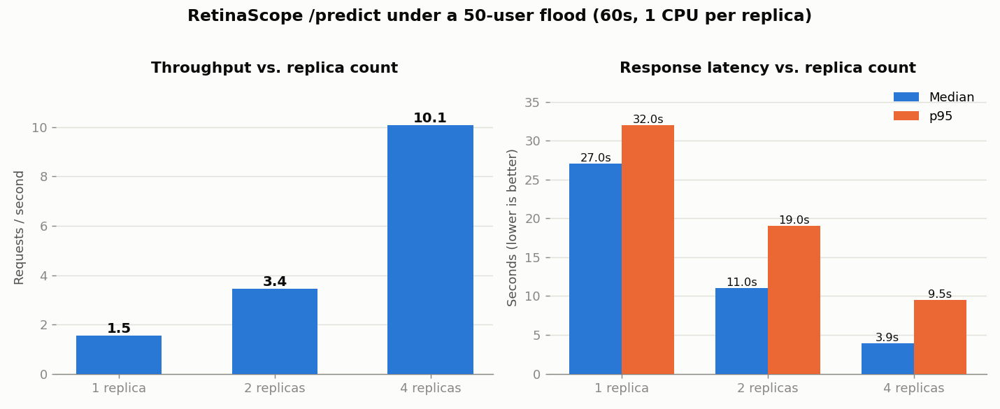

# RetinaScope - Diabetic Retinopathy Classification Pipeline

An end-to-end machine-learning pipeline that grades **diabetic retinopathy (DR)**
severity from retina fundus photographs, deployed as a live API with a web UI,
a retraining loop, and a containerised horizontal-scaling load test.

Built for *Machine Learning Pipeline* - the full ML cycle
on non-tabular (image) data: acquisition → preprocessing → training → evaluation
→ deployment → monitoring → retraining → load testing.

## Links

| | |
|---|---|
| **Live API** (FastAPI) | https://retinascope.onrender.com — interactive docs at [`/docs`](https://retinascope.onrender.com/docs) |
| **Live UI** (Streamlit) | https://retinascope-ml.streamlit.app |
| **Demo video** (YouTube) | https://youtu.be/wMcIpIkTd9Q |

> The API runs on Render's free tier: it **spins down after ~15 min idle**, so the
> first request after a pause takes 30–60 s to cold-start. That is expected, not a bug.

---

## What it does

Given a retina image, RetinaScope predicts one of three DR severity classes:

| Class | Meaning | Source (APTOS 5-class) |
|---|---|---|
| `No_DR` | No diabetic retinopathy | No_DR |
| `Mild_Moderate` | Early / non-proliferative DR | Mild + Moderate |
| `Severe_Proliferate_DR` | Vision-threatening DR | Severe + Proliferative |

The 5-class APTOS labels were regrouped into 3 because the two rarest raw classes
(~200–300 images each) were too thin to survive a stratified train/test/retrain
split. The grouping stays clinically coherent: *none / early / vision-threatening*.

### Core features

- **Single-image prediction** - upload one image, get a class + per-class probabilities.
- **Three dataset feature interpretations** - class-imbalance, colour-balance, and
  texture-variance analyses (see the notebook / UI Visualizations page).
- **Bulk upload + retraining** - upload many labelled images and trigger retraining,
  manually or automatically past an upload threshold.
- **Promotion gate** - a retrained model is deployed **only if it beats the current
  model** on a frozen test set; otherwise the old model is kept. The old model is
  archived and the live model hot-reloads without a restart.
- **Uptime / status monitoring** - model version, last-retrain timestamp, request counts.
- **Horizontal-scaling load test** - Locust flood across 1/2/4 container replicas
  behind nginx.

---

## Architecture

```
                 ┌──────────────┐        ┌─────────────────────────┐
  user  ───────► │  Streamlit   │ ─HTTP─►│      FastAPI API        │
                 │     UI       │        │  /predict  /health      │
                 │ (4 pages)    │ ◄──────│  /metrics  /upload      │
                 └──────────────┘        │  /retrain  /status      │
                                         └───────────┬─────────────┘
                                                     │
                              ┌──────────────────────┼───────────────────────┐
                              ▼                       ▼                        ▼
                     preprocessing.py           prediction.py            retrain.py
                   (shared train/infer      (loads model, predicts)  (merge base+pool+
                    path + Ben-Graham                                 uploads, promotion
                    filter on uploads)                                gate, hot-reload)
                                                     │
                                                     ▼
                                          models/mobilenetv2_dr.keras
```

- **Model:** MobileNetV2 transfer learning (ImageNet base, two-phase fine-tuning).
- **API:** FastAPI + Uvicorn (single worker, required by the in-memory retrain job lock).
- **UI:** Streamlit (decoupled from TensorFlow; talks to the API over HTTP).
- **Containerisation:** Docker; docker-compose + nginx for the scaling test.
- **Cloud:** Render (public API). UI on Streamlit Cloud.

---

## Repository structure

```
RetinaScope/
├── README.md
├── notebook/
│   └── RetinaScope.ipynb        # EDA, 3 feature interpretations, training, full evaluation
├── src/
│   ├── constants.py             # shared class names / image size (no heavy imports)
│   ├── data_acquisition.py      # 5→3 class remap + stratified train/test/retrain split
│   ├── preprocessing.py         # shared train/inference path + Ben-Graham filter
│   ├── model.py                 # scratch CNN + MobileNetV2 builders
│   ├── prediction.py            # model load / predict / hot-reload
│   └── retrain.py               # merge-with-base retraining + promotion gate
├── data/
│   ├── train/  test/  retrain_pool/   # 3-class image folders (stratified split)
│   └── manifest.csv
├── models/
│   ├── mobilenetv2_dr.keras     # production model (served by the API)
│   ├── scratch_cnn.keras        # baseline for the comparison
│   └── model_meta.json          # version + last-retrain metadata
├── main.py                      # FastAPI app (prediction + retraining endpoints)
├── streamlit_app.py             # Streamlit UI (4 pages)
├── Dockerfile                   # API image (data/ baked in for retraining)
├── docker-compose.yml           # nginx + scalable API replicas (load test)
├── locustfile.py                # Locust load profile
├── deploy/
│   ├── nginx.conf               # round-robin load balancer across replicas
│   ├── run_load_tests.sh        # 1/2/4-replica test harness
│   ├── make_chart.py            # renders the scaling chart
│   └── loadtest_results/        # CSVs, chart, analysis
├── requirements.txt             # UI dependencies (Streamlit; Streamlit Cloud auto-detects this)
└── requirements-api.txt         # API + training/notebook dependencies (incl. TensorFlow)
```

---

## Model & evaluation

Two models were trained and compared on a **frozen test set** (never seen during
training or model selection — a validation split carved from the training data was
used for early stopping):

| Metric | Scratch CNN | **MobileNetV2** (selected) |
|---|:--:|:--:|
| Accuracy | 0.712 | **0.814** |
| Macro-F1 | 0.605 | **0.742** |
| Weighted-F1 | 0.723 | **0.819** |
| Macro-AUC (one-vs-rest) | 0.877 | **0.925** |

Per-class F1 (MobileNetV2): No_DR **0.96**, Mild_Moderate **0.73**,
Severe_Proliferate_DR **0.53**. The rarest, most clinically important class is the
hardest (recall ~0.66) — an honest ceiling given only 73 test / 342 train images
there; class weighting and transfer learning nearly doubled its F1 over the scratch
baseline. Full confusion matrices, ROC/PR curves and learning curves are in the notebook.

---

## Setup

**Requirements:** Python 3.13, and Docker Desktop for the container/scaling parts.

```bash
git clone https://github.com/jmuhire13/RetinaScope.git
cd RetinaScope
pip install -r requirements-api.txt      # API + training/notebook deps (incl. TensorFlow)
pip install -r requirements.txt          # UI deps (Streamlit; no TensorFlow)
```

### Run the notebook

```bash
jupyter notebook notebook/RetinaScope.ipynb
```

### (Re)build the data split — optional

The `data/` folders are committed, but the split is reproducible:

```bash
python src/data_acquisition.py
```

### Run the API locally

```bash
uvicorn main:app --host 127.0.0.1 --port 8000
# open http://127.0.0.1:8000/docs
```

### Run the UI locally

```bash
# with the API running above:
streamlit run streamlit_app.py
# sidebar "API URL" defaults to http://localhost:8000
```

### Run the whole thing in Docker

```bash
docker build -t retinascope-api:latest .
docker run -p 8000:8000 retinascope-api:latest
```

---

## API reference

| Method | Path | Purpose |
|---|---|---|
| `GET` | `/health` | Status, uptime, model version, last-retrain timestamp |
| `GET` | `/metrics` | Uptime, total requests, total predictions |
| `POST` | `/predict` | Predict on one uploaded image (PNG/JPEG) |
| `POST` | `/upload` | Bulk-upload labelled images (`files` + `label` form field) |
| `POST` | `/retrain` | Start retraining — returns `202` + `job_id` immediately (non-blocking) |
| `GET` | `/status` | Retrain job state, live progress, before/after metrics |

Example prediction:

```bash
curl -X POST https://retinascope.onrender.com/predict \
     -F "file=@some_retina.png;type=image/png"
```

---

## Retraining

Retraining is designed so it **cannot forget**: every run merges the base training
set + the held-out `retrain_pool` + any uploaded images, then evaluates the result
on the frozen test set. It **never trains on uploaded data alone**. A new model is
promoted only if its macro-F1 beats the current model's; otherwise the current model
is kept. The old model is archived and the live model hot-reloads — no restart.

- **Manual trigger:** the UI's *Trigger Retraining* button (`POST /retrain`).
- **Automatic trigger:** once uploaded images pass a threshold (`POST /upload`).

The base training data is **baked into the Docker image** so retraining works with no
external fetch. On Render's free tier the persisted model reverts on cold-start (no
persistent disk), so retraining is demonstrated **locally** (training exceeds the free
tier's memory anyway). The demo video is the durable record of a full retrain cycle.

---

## Load test — horizontal scaling

An identical Locust flood (**50 users, 60 s**) was run against **1, 2, and 4 API
replicas** behind nginx, each replica capped at 1 CPU so added replicas add real
capacity. Run locally via `docker-compose` (Render's free tier can't scale replicas).

| Replicas | Throughput (req/s) | Median latency | p95 latency | Failures |
|:--:|:--:|:--:|:--:|:--:|
| 1 | 1.5 | 27.0 s | 32.0 s | 0 |
| 2 | 3.4 | 11.0 s | 19.0 s | 0 |
| 4 | **10.1** | **3.9 s** | 9.5 s | 0 |



Throughput scales strongly and tail latency collapses as replicas are added, with
**zero failures** at every scale. The scaling is super-linear because the single
replica is in deep saturation under the flood — see
[`deploy/loadtest_results/ANALYSIS.md`](deploy/loadtest_results/ANALYSIS.md) for the
full, honest interpretation.

Reproduce:

```bash
bash deploy/run_load_tests.sh      # runs 1/2/4 replicas, writes CSVs
python deploy/make_chart.py        # renders the chart
```

---

## Tech stack

TensorFlow / Keras · FastAPI · Uvicorn · Streamlit · scikit-learn (notebook only) ·
OpenCV · Docker · nginx · Locust · Render · Streamlit Cloud.
